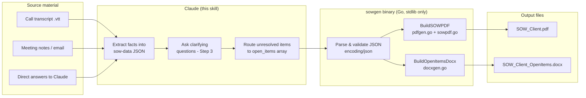
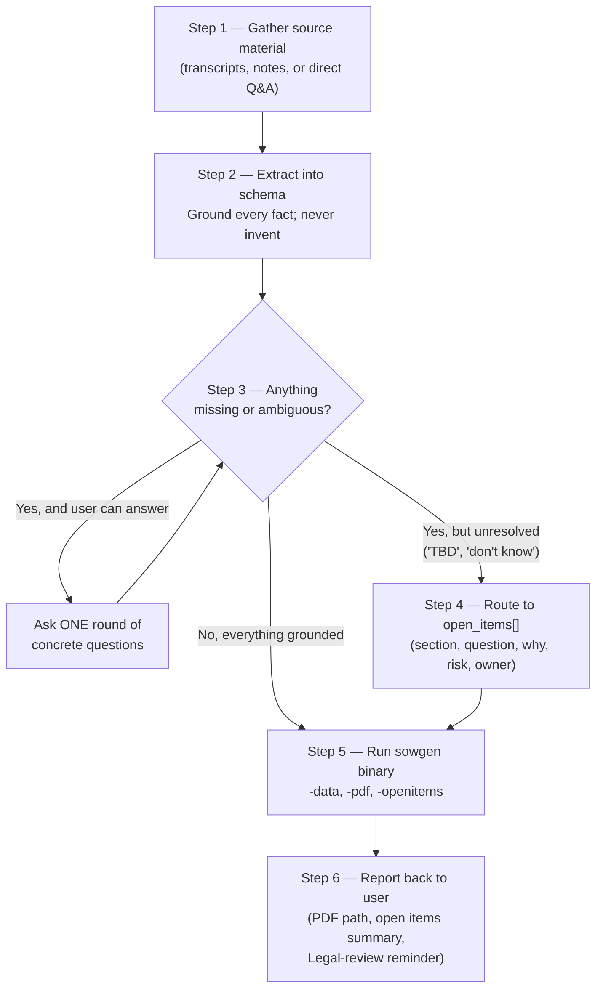
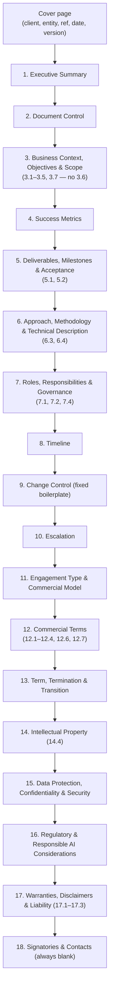

# sow-generator — Complete Technical Documentation

This document describes the `sow-generator` Claude Code skill in full: what it does, how
Claude uses it, the exact JSON schema it consumes, precisely how the PDF renderer works
(fonts, layout, pagination, section-by-section mapping), and every known limitation of
the rendering engine. It is written for two audiences at once: someone deciding whether
to trust this tool for a real client SOW, and someone maintaining or extending the Go
source.

If you only need the short version, read the `SKILL.md` in this same folder — that's
what Claude actually loads at runtime. This file is the deep reference underneath it.

---

## 1. What this skill is

`sow-generator` turns unstructured input (a call transcript, meeting notes, a scoping
email, or direct answers to questions) into two client-facing documents:

1. **A Statement of Work PDF** — signature-ready in format, 18 numbered sections plus a
   cover page, styled consistently in a navy/gold/slate palette.
2. **An Open Items Register DOCX** (optional, only produced if there's anything
   unresolved) — a landscape table of everything that couldn't be confirmed from the
   source material, so it never gets silently invented into the contract.

The actual PDF/DOCX generation is done by a **pre-compiled Go binary** (`bin/sowgen-*`),
not by Claude writing a document by hand. Claude's job is to read the source material,
populate a JSON file matching the schema, ask the user about genuine gaps, and then
invoke the binary. This separation is deliberate: the binary is deterministic and
stdlib-only (no network calls, no external dependencies), so the same JSON always
produces byte-identical output, and there is no way for an LLM's phrasing quirks to leak
into contractual layout or formatting.

### 1.1 End-to-end architecture



**Why it's split this way:** an LLM is good at reading messy human input and judging
what's missing; it is not a reliable typesetting engine. A hand-written Go PDF renderer
is the reverse — perfectly consistent output, zero judgment. Putting the boundary at a
JSON file means you can inspect, diff, and regenerate from the exact same input, and the
"never invent a fact" rule is enforced structurally: if Claude doesn't write a value into
the JSON, the renderer shows a gold `[Not yet confirmed]` placeholder — it cannot
silently paper over a gap the way free-form prose generation could.

### 1.2 Where the files live

This is a **global Claude Code skill** — normally installed at
`~/.claude/skills/sow-generator/` (Linux/macOS/WSL) or
`%USERPROFILE%\.claude\skills\sow-generator\` (Windows), independent of any single
project. In this environment specifically, that path is a **symlink** into this git
repository (`cegeka_skill_registry/sow-generator`), so editing either location edits the
same files — see the registry's top-level `README.md`.

```
sow-generator/
├── SKILL.md                                   # what Claude reads to operate the skill
├── DOCUMENTATION.md                           # this file
├── bin/
│   ├── sowgen-linux-amd64                     # pre-compiled, no runtime deps
│   └── sowgen-windows-amd64.exe
├── schema/
│   ├── sow-data.schema.json                   # the JSON Schema — source of truth
│   └── example-data.json                      # a fully-populated worked example
├── reference/
│   └── SOW_Template_Data_AI_Best_Practice.html  # visual/structural reference doc
└── src/                                       # Go source, stdlib only
    ├── main.go        # CLI entry point (-data / -pdf / -openitems flags)
    ├── model.go        # SOWData struct — mirrors the JSON schema exactly
    ├── pdfgen.go        # low-level PDF drawing primitives + PDF file assembly
    ├── sowpdf.go        # the actual 18-section SOW layout, using pdfgen.go's primitives
    └── docxgen.go       # minimal OOXML .docx writer for the Open Items Register
```

There is **no build step for end users** — both binaries are committed to the repo.
Rebuilding is only needed after a source change (see §7).

---

## 2. How Claude uses the skill (the 6-step process)

This is what `SKILL.md` actually instructs Claude to do. It's summarized here with a
diagram; the authoritative wording lives in `SKILL.md` itself.



Key rules embedded in this process (from `SKILL.md`):

- **Never invent** a client name, legal entity, fee, date, percentage, named individual,
  or metric target. An empty field renders as a gold placeholder — that's intentional,
  not a bug to fix by guessing.
- **Distinguish assumptions vs. prerequisites vs. dependencies** — they are different
  legal concepts (see §3.3 below) and collapsing them into one bucket is a drafting error.
- **Deliverables and priority are the most scrutinized part of the document** — every
  deliverable needs a stated priority, a milestone tie, and an objectively testable
  acceptance criterion, or it's a Step 3/4 gap, not something to paper over.
- **One round of clarifying questions.** If the user doesn't know an answer, it goes to
  `open_items`, not into a second or third round of asking.
- The signature block is **never a schema field** — the renderer always leaves it blank.

---

## 3. The JSON Schema (`schema/sow-data.schema.json`)

The schema is the contract between Claude (which populates it) and the Go binary (which
renders it). Every top-level key below maps to one or more numbered sections in the
rendered PDF — the mapping is given in §5.4.

**General rules that apply to every field:**
- Every field is optional. `omitted` and `""` behave identically to the renderer.
- An empty string/array renders as an italic gold `[Not yet confirmed]` placeholder in
  the PDF — this is a deliberate signal, not a rendering failure.
- Values are rendered **verbatim** — no locale-aware number formatting, no date parsing,
  no currency symbol insertion. If you write `"150000"` it prints `150000`, not
  `150,000`.

### 3.1 `meta`, `doc_control` — document identity

```json
{
  "meta": { "ref": "SOW-2201", "version": "v1.0", "date": "2026-09-15" },
  "doc_control": {
    "client_legal_name": "Northwind Retail Group B.V.",
    "cegeka_entity": "Cegeka NV",
    "msa_date": "2025-03-01",
    "effective_date": "2026-10-01",
    "sow_owner_cegeka": "Anke Peeters, Engagement Lead, anke.peeters@cegeka.com",
    "sow_owner_client": ""
  }
}
```

`meta.ref`/`version`/`date` populate the cover page and the Document Control table
(Section 2). `sow_owner_client` left empty above renders as `[Not yet confirmed]` in
that row — a realistic case where the client hasn't named their own SOW owner yet.
`version` defaults to `"v1.0"` if omitted (handled in Go via `firstNonEmpty`, not JSON
Schema `default` — see §6.2 for why that distinction matters).

### 3.2 `exec_summary` — the one-page pitch

```json
{
  "exec_summary": {
    "vision_statement": "A single source of truth across five countries they can trust.",
    "narrative": "Northwind's invoice-matching process is largely manual...",
    "what_we_deliver": "An AI-assisted invoice matching pilot integrated with the ERP.",
    "how_success_measured": "Matching precision on a frozen test set...",
    "commercial_headline": "EUR 180,000 fixed fee **+ pass-through Azure OpenAI costs**"
  }
}
```

`vision_statement` is rendered first, in a distinct bold navy lead line (larger and
bolder than the rest of the exec summary — see `WriteLead` in §5.2), deliberately ahead
of `narrative`. This ordering reflects direct client feedback from a template review:
lead with the client's own stated end-state, then the current-state problem that
creates the gap to it, then the engagement as the path across that gap — never open
with architecture or technology.

`commercial_headline` is the **one field in the entire schema** where `**bold**` markup
actually renders as bold text in the PDF (via `WriteValueBold` — see §5.3). This exists
specifically so a pass-through/reimbursed cost addition (e.g. cloud consumption billed
separately from a fixed fee) is impossible to miss at a glance. Writing `**bold**`
anywhere else in the schema does nothing — it prints literal asterisk characters (see
§6.5).

### 3.3 `context_scope` — business context, objectives, and scope

```json
{
  "context_scope": {
    "business_context": "Northwind's finance shared-service centre processes 40,000 invoices/month...",
    "objectives": [
      { "text": "Reduce manual invoice-matching effort by an estimated 40%...", "type": "tactical" },
      { "text": "Establish the data foundation for Northwind's 2027 finance roadmap.", "type": "strategic" }
    ],
    "workstreams": [
      { "workstream": "Discovery & Data Assessment", "in_scope": "Invoice/PO data inventory...", "out_of_scope": "Remediation of data quality issues found" }
    ],
    "assumptions": ["Data volumes do not exceed 50,000 invoices/month..."],
    "prerequisites": ["ERP read access and credentials for the named Cegeka team members."],
    "data_provided": "Historical invoice and PO records (24 months)...",
    "dependencies": ["Northwind's concurrent ERP consolidation project proceeding on schedule."]
  }
}
```

Three lists that look similar but mean different things — this distinction is drafting
guidance baked into the schema, not just a naming convention:

| Field | Meaning | Who controls it |
|---|---|---|
| `assumptions` | Conditions the price/timeline/scope is *priced on the belief of* — not something either party must actively deliver, but if false, the estimate needs reconsidering | Neither — a shared premise |
| `prerequisites` | A dated, pre-kickoff readiness gate — concrete things the client must provide by a specific point | Client |
| `dependencies` | External factors that affect delivery but that neither party controls (e.g. a client's concurrent project finishing on schedule) | Neither |

`objectives[].type` must be `"tactical"` or `"strategic"` — rendered as a `[Tactical]` /
`[Strategic]` tag prefix on each bullet (Section 3.2). `workstreams[].workstream` is the
only field in the whole document rendered in **bold** inside a table cell (via the
`Table(...)`'s `boldCol` argument — see §5.5); its `in_scope`/`out_of_scope` text should
state *why* something is (or isn't) in scope, not just restate what, per the schema's own
field description.

> **Note on `3.6`:** an earlier version of this schema had a
> `reference_case_study_allowed` boolean here (a yes/no flag on whether Cegeka could
> reference the engagement as a case study). It was removed after client review feedback
> that it "creates no value, only creates question marks." The rendered PDF's section
> numbering still has a gap where 3.6 used to be (3.5 → 3.7, no 3.6) — see §6.6 for why
> that gap was deliberately left rather than renumbered.

### 3.4 `success_metrics`

```json
{
  "success_metrics": [
    {
      "metric": "Matching precision",
      "definition": "TP / (TP+FP) on the frozen 500-invoice test set in Appendix B",
      "target": ">=0.85",
      "window": "30 days post pilot go-live",
      "validated_by": "Joint",
      "consumed_by": "Finance Ops reviews weekly to decide whether to expand the pilot"
    }
  ]
}
```

`target` must be an actual quantifiable number/threshold once confirmed — a metric with
an empty target is a genuine gap (route it to Step 3 questions or `open_items`, don't
ship it blank long-term). `consumed_by` is a newer field: who acts on the metric, through
what workflow, how often, and why it changes their behavior. This exists because a
metric nobody consumes doesn't build a business case — it's a number on a slide.

If `commercial_model` is `outcome_based` or `hybrid`, this array is **not optional** per
`SKILL.md` — an empty array here on an outcome-based deal is a Step 3 question, not a
skippable section.

### 3.5 `deliverables` — the most scrutinized section

```json
{
  "deliverables": [
    {
      "id": "D1",
      "name": "Data & AI Readiness Assessment report",
      "priority": "must-have",
      "format": "PDF",
      "milestone": "M1",
      "target_date": "2026-10-24",
      "acceptance_criteria": "Covers agreed dimensions in Appendix B; presented to steering committee",
      "acceptance_process": "Client has 3 business days to review; deemed accepted if no written objection"
    }
  ]
}
```

`priority` is a closed enum: `must-have` / `should-have` / `nice-to-have` — anything else
renders literally as `[unset]` in the PDF table rather than silently defaulting (see
`sowpdf.go`'s deliverables loop). Per schema guidance, **a report/dashboard-style
deliverable defaults to `should-have`/`nice-to-have`**, not `must-have` — the underlying
data/platform work behind it is usually the real must-have, unless the client explicitly
insists on committing to the report itself. `milestone` here is a free-text label (e.g.
`"M1"`) that should match an entry in `timeline[]` and/or
`commercial.milestone_payments[]` — **the renderer does not cross-check this**; a typo'd
milestone ID across sections will render silently inconsistent (see §6.9).

`acceptance_criteria` must be something a third party could adjudicate pass/fail on
without either party's testimony — a vague criterion here is exactly the kind of gap
that turns into a margin-losing dispute on a fixed-fee deal.

### 3.6 `acceptance`, `approach`, `roles`, `timeline`

```json
{
  "acceptance": {
    "review_window_business_days": 3,
    "rework_rounds_included": "2",
    "checkpoint_timing": "At approximately two-thirds of elapsed pilot duration,",
    "checkpoint_description": "the parties hold a joint checkpoint to confirm the pilot remains on track..."
  },
  "approach": {
    "project_type": "poc_pilot",
    "phases": [
      { "phase": "Discovery & Feasibility", "fee_treatment": "Fixed fee", "gate_decision": "Go/no-go" },
      { "phase": "Hypercare", "fee_treatment": "T&M", "gate_decision": "Not applicable for this pilot" }
    ],
    "technical_description": "Azure-hosted matching service using Azure OpenAI...",
    "governance_cadence": "Bi-weekly steering committee; weekly RAG status email."
  },
  "roles": {
    "cegeka_team": "1 Engagement Lead (20%), 1 Data Scientist (80%)...",
    "client_team": "1 Finance Ops Sponsor, 1 SME (8h/week).",
    "client_obligations": ["Named business sponsor with decision authority..."],
    "delay_grace_business_days": "5"
  },
  "timeline": [
    { "milestone": "Kick-off (M0)", "target_date": "2026-10-01", "dependency": "Contract execution" }
  ]
}
```

`acceptance.review_window_business_days` defaults to **3** if the JSON value is `0`
(Go's zero-value for `int` — see §6.2, this is a real gotcha: you cannot explicitly set
this to 0 business days, since 0 is indistinguishable from "not set").

`approach.project_type` gates whether the **Hypercare** phase row is shown at all: a
phase literally named `"Hypercare"` (case-insensitive) in the `phases[]` array is
**silently dropped from the rendered table** unless `project_type` is exactly
`"industrialization_rollout"`. This is a real, easy-to-miss behavior — see §6.7.

`roles.delay_grace_business_days` feeds a specific hard-coded sentence in Section 7.4
("If Client fails to meet an obligation... within `<N>` business days... Cegeka may
extend the timeline day-for-day..."). Leave it empty and that whole paragraph renders
blank (via `WriteValue` on an empty string — not even a placeholder, see §6.8).

`timeline[]` is rendered as Section 8, and is explicitly a **different concept** from
`commercial.milestone_payments[]` (Section 12) and from the new `escalation` object
(Section 10) — this separation was direct client feedback (a prior draft conflated
"activities/deliverable dates," "payment milestones," and "escalation" under one mental
model, which confused reviewers). All three now render as visually and structurally
distinct sections.

### 3.7 `commercial_model` and `commercial`

```json
{
  "commercial_model": "fixed_fee",
  "commercial": {
    "total_fee": "EUR 180,000",
    "milestone_payments": [
      { "milestone": "M1", "deliverable": "D1", "target_date": "2026-10-24", "amount": "30%", "trigger": "Upon acceptance", "funding_source": "Client" },
      { "milestone": "M4", "deliverable": "Finalized Engagement", "target_date": "2026-12-19", "amount": "EUR 75,000", "trigger": "Invoiced to Microsoft on final sign-off", "funding_source": "Partner-Led Funding" }
    ],
    "payment_terms": "Net 30 from invoice date, EUR.",
    "expenses_policy": "No travel expenses apply; delivery is remote from Cegeka offices unless otherwise agreed.",
    "pass_through_policy": "Azure OpenAI consumption is pass-through, invoiced at cost + 5% handling fee, capped at EUR 1,500/month absent written pre-approval.",
    "cofunding_program": "Microsoft Partner-Led Funding (ECIF) — verified and applied.",
    "invoicing_address": "Northwind Retail Group B.V., Finance Dept, Amsterdam",
    "invoicing_email": "ap@northwindretail.example",
    "invoicing_contact_name": "Sara de Vries",
    "invoicing_contact_phone": "+31 20 555 0101",
    "po_number": ""
  }
}
```

`commercial_model` is a **closed enum**: `fixed_fee` / `outcome_based` / `hybrid` /
`time_and_materials`. All four options are always listed as checkboxes in Section 11
regardless of which one is selected (`[X]`/`[ ]` markers) — the renderer does not hide
unselected options.

**Funding-program milestones must be their own line**, per direct client feedback: if
part of the fee is covered by a vendor co-funding program (e.g. Microsoft's Partner-Led
Funding / ECIF), the customer-paid milestones should sum to 100% of the
*customer-payable net* amount, and the funded portion gets a **separate milestone
entry** with `funding_source` set to `"Partner-Led Funding"` (not blended into the
customer's percentages). The `funding_source` column always renders — an unset value
defaults to `"Client"` via Go's `firstNonEmpty`, so every row is always explicit about
who's paying it.

Use the standard term **"Partner-Led Funding"** consistently in `cofunding_program`;
name the specific vendor program once for clarity (e.g. "Microsoft ECIF"), then refer
back to the generic term rather than switching acronyms throughout the document.

`pass_through_policy` and `expenses_policy` should both be stated explicitly rather than
left blank when the answer is actually known — e.g. "pass-through costs are billed
separately and are not subject to `payment_terms`" reads as *already handled*, whereas a
blank field reads as *overlooked*.

### 3.8 `term`, `ip`, `escalation`, `data_protection`, `regulatory`, `liability`, `contacts`

```json
{
  "term": { "end_condition": "final deliverable acceptance", "termination_notice_days": "30", "transition_assistance": "Handover documentation included..." },
  "ip": { "model_artifacts_ownership": "The fine-tuned model and prompts created specifically for Client are licensed to Client..." },
  "escalation": { "owner_role": "Project/Engagement Manager", "response_sla_business_days": "5", "sla_reference": "Per MSA" },
  "data_protection": { "processor_role": "Cegeka acts as Processor...", "subprocessors": ["Microsoft Azure OpenAI Service (EU data boundary)"], "retention_policy": "" },
  "regulatory": { "ai_risk_classification": "To be jointly determined during Discovery.", "human_oversight": "All matches below 0.9 confidence are routed to human review.", "bias_fairness_testing": "Out of scope for this pilot." },
  "liability": { "cap": "" },
  "contacts": { "client_day_to_day": "Sara de Vries, Finance Ops Manager, ...", "cegeka_day_to_day": "Anke Peeters, Engagement Lead, ..." }
}
```

`escalation` is a **new, standalone section** (Section 10) added specifically to avoid
conflating issue-escalation during delivery with the delivery timeline or the payment
schedule. Only `response_sla_business_days` (used for Level 2) is actually
data-driven from this object in the current renderer — Level 1's SLA is hard-coded to
"2 business days" and Level 3 always shows `sla_reference` verbatim rather than a day
count. See §5.4/Section 10 for the exact table this produces — this is a genuine
asymmetry worth knowing about if you expect all three levels to be equally
configurable.

`data_protection` should never default to "not applicable / no GDPR data" — per schema
guidance, most SOWs name at least one client contact (name, email, phone), which is
itself personal data, so this section is rarely genuinely inapplicable. Standard clause
text should be sourced from Legal/the MSA rather than invented or left blank.

`ip.model_artifacts_ownership` only makes sense when the engagement actually produces a
trained model/AI artifact — for a pure BI/reporting engagement, this field is likely
`""` (renders as a placeholder) or should state explicitly "not applicable — no AI/ML
model is produced under this engagement" rather than being left ambiguous.

### 3.9 `open_items` — the escape hatch

```json
{
  "open_items": [
    {
      "section": "12.7 — Invoicing details",
      "question": "Client has not provided a PO number/reference.",
      "why_it_matters": "Northwind's AP process may require a PO on every invoice to pay it.",
      "risk_if_unresolved": "First invoice could bounce or be delayed, straining the relationship right after go-live.",
      "suggested_owner": "Client"
    }
  ]
}
```

This array is rendered **only** in the separate Open Items Register DOCX — never in the
SOW PDF itself, and never as an invented value standing in for the gap. `section` and
`question` are required by the schema (`"required": ["section", "question"]`); the other
three fields are strongly encouraged (`SKILL.md` treats omitting them as a drafting
shortcut to avoid) but not schema-enforced. If `open_items` is empty, `main.go` skips
writing the DOCX file entirely and prints a note to stderr instead — passing `-openitems`
with nothing to put in it is a no-op, not an error.

---

## 4. Full schema reference table

| Path | Type | Renders in section | Notes |
|---|---|---|---|
| `meta.ref` | string | Cover, §2 | SOW reference number |
| `meta.version` | string | Cover, §2 | Defaults to `v1.0` in Go if empty |
| `meta.date` | string | Cover | Raw string, not parsed |
| `doc_control.*` | strings | §2 (table) | 6 of 7 fields also feed the cover page |
| `exec_summary.vision_statement` | string | §1 | Bold navy lead line — see §5.2 |
| `exec_summary.narrative` | string | §1 | |
| `exec_summary.what_we_deliver` | string | §1 | |
| `exec_summary.how_success_measured` | string | §1 | |
| `exec_summary.commercial_headline` | string | §1 | Only field supporting `**bold**` markup |
| `context_scope.business_context` | string | §3.1 | |
| `context_scope.objectives[]` | array | §3.2 | `.type` must be `tactical`/`strategic` |
| `context_scope.workstreams[]` | array | §3.2 table | `.workstream` renders bold |
| `context_scope.assumptions[]` | array | §3.3 | |
| `context_scope.prerequisites[]` | array | §3.4 | |
| `context_scope.data_provided` | string | §3.5 | |
| `context_scope.dependencies[]` | array | §3.7 (no §3.6 — see §6.6) | |
| `success_metrics[]` | array | §4 (table) | `.target` should be a real number |
| `deliverables[]` | array | §5 (table) | Priority is a closed enum |
| `acceptance.*` | mixed | §5.1, §5.2 | `review_window_business_days` int, defaults 3 |
| `approach.project_type` | enum | Gates Hypercare row | `advisory`/`poc_pilot`/`industrialization_rollout` |
| `approach.phases[]` | array | §6 (table) | |
| `approach.technical_description` | string | §6.3 | |
| `approach.governance_cadence` | string | §6.4 | |
| `roles.*` | mixed | §7 | `.delay_grace_business_days` feeds §7.4 sentence |
| `timeline[]` | array | §8 (table) | Distinct from milestone payments |
| `commercial_model` | enum | §11 (checkboxes) | All 4 options always shown |
| `commercial.total_fee` | string | §12.1 | |
| `commercial.milestone_payments[]` | array | §12 (table) | `.funding_source` new column |
| `commercial.payment_terms` | string | §12.2 | |
| `commercial.expenses_policy` | string | §12.3 | |
| `commercial.pass_through_policy` | string | §12.4 | |
| `commercial.cofunding_program` | string | §12.6 | Empty → "Not applicable" sentence |
| `commercial.invoicing_*` | strings | §12.7 (table) | 5 fields incl. new contact name/phone |
| `term.*` | strings | §13 | |
| `ip.model_artifacts_ownership` | string | §14.4 | |
| `escalation.*` | strings | §10 (table) | New section; only L2 fully data-driven |
| `data_protection.*` | mixed | §15 | |
| `regulatory.*` | strings | §16 | |
| `liability.cap` | string | §17.3 | |
| `contacts.*` | strings | §18 | |
| `open_items[]` | array | DOCX only | Never rendered in the PDF |

---

## 5. How the PDF renderer actually works

The renderer (`pdfgen.go` + `sowpdf.go`) writes raw PDF 1.4 syntax directly — there is no
PDF library dependency, no HTML/CSS-to-PDF conversion, no headless browser. It builds a
content stream of PDF drawing operators (`Tj` for text, `re`/`f`/`S` for rectangles and
lines) page by page, then assembles the file's object table and cross-reference table by
hand in `PDF.Bytes()`.

### 5.1 Page geometry

```go
const (
    pageW     = 595.0   // A4 width in points (595.27pt ≈ 210mm)
    pageH     = 842.0   // A4 height in points (841.89pt ≈ 297mm)
    marginX   = 50.0    // left/right margin
    marginTop = 60.0    // top margin (from which content starts)
    marginBot = 55.0    // bottom margin (pagination trigger)
)
```

Every page is A4 portrait. `EnsureSpace(h)` starts a new page whenever drawing `h` more
points would cross `marginBot` — this is the **only** pagination mechanism; there's no
manual page-break control, no "keep together" for a heading + its content (a heading can
theoretically land at the very bottom of a page with its content starting on the next —
`SectionHeading` calls `EnsureSpace(24)` before drawing, which mitigates but doesn't
eliminate this for very tall content immediately following).

### 5.2 Fonts, color palette, and text styling

Five **base-14 standard fonts** are declared (no font embedding — every PDF viewer has
these built in):

| Key | PDF base font | Used for |
|---|---|---|
| `F1` | Helvetica | Body text (9.5pt), table cells (8.5pt) |
| `F2` | Helvetica-Bold | Headings, sub-headings, table headers, bold spans, bold table column |
| `F3` | Helvetica-Oblique | Gold `[Not yet confirmed]` placeholders, footer note |
| `F4` | Times-Bold | Section titles (15pt), cover page title (24/16pt) |
| `F5` | Courier | Declared but not actively used by any current section |

```go
var (
    colNavy    = rgb{0.0, 0.169, 0.286}   // #002B49 — headings, section bars
    colGold    = rgb{0.722, 0.525, 0.043} // #B8860B — placeholders, dividers, footer
    colSlate   = rgb{0.290, 0.325, 0.404} // #4A5568 — body text
    colDivider = rgb{0.886, 0.906, 0.933} // #E2E8F0 — table borders, hairlines
    colWhite   = rgb{1, 1, 1}             // table header text
)
```

This is a **fixed palette** — there is no theming mechanism. Changing brand colors means
editing these five constants and rebuilding.

`WriteValue` is the workhorse: it renders a string in slate F1 9.5pt, or — if the string
is empty/whitespace-only — an italic gold `[Not yet confirmed]` in F3. This single
function is what makes "leave it empty rather than invent it" visually obvious in the
output; almost every field in `sowpdf.go` routes through it. Two variants exist for
special cases:
- `WriteLead` — same placeholder behavior, but non-empty values render bold navy 11pt
  (used only for `exec_summary.vision_statement`).
- `WriteValueBold` — same placeholder behavior, but non-empty values are passed through
  `ParagraphBold`, which recognizes `**...**` spans and renders them in F2 instead of F1
  (used only for `exec_summary.commercial_headline`).

### 5.3 The `**bold**` inline markup — how it actually works

```go
func parseBoldWords(s string) []styledWord {
    s = sanitize(s)
    var words []styledWord
    parts := strings.Split(s, "**")
    for i, part := range parts {
        bold := i%2 == 1
        for _, w := range strings.Fields(part) {
            words = append(words, styledWord{text: w, bold: bold})
        }
    }
    return words
}
```

This is **not** a Markdown parser — it's a single-purpose `**...**` span splitter. It
splits the (already-sanitized) string on literal `**` and alternates plain/bold on each
resulting segment, then tokenizes into words. Consequences:

- An **odd** number of `**` markers in a string means everything after the last one is
  treated as bold (there's no "unterminated span" error — it just keeps alternating).
- No other Markdown syntax works: `*italic*`, `_underline_`, `` `code` ``, `[links](url)`
  all render as literal characters, because nothing else in the renderer looks for them.
- This exists in exactly **one** field (`commercial_headline`, via `WriteValueBold`).
  Writing `**bold**` in any other field (e.g. a deliverable name, an assumption) does
  nothing special — it prints literal asterisk characters, because that field is drawn
  via plain `WriteValue`/`Paragraph`, which never calls `parseBoldWords`.

The word-wrapping in `ParagraphBold` reconstructs runs of consecutive same-style words
into a single `Tj` (text-show) operator with real space characters between them,
specifically to avoid a known PDF-viewer gotcha: drawing each word as its own `Tj` with
only positional (`Tm`) offsets between them (no literal space glyph in the content
stream) causes many PDF text-extraction tools to glue words together on copy/paste. This
is a deliberate correctness fix, not an arbitrary implementation detail.

### 5.4 Section-by-section map

The document is built as one continuous function (`BuildSOWPDF` in `sowpdf.go`) that
calls `SectionHeading("N. Title")` for each of 18 sections in a fixed order, drawing a
navy bar + bold Times-Bold 15pt title + a divider line under each one:



Two sections are **entirely fixed boilerplate**, not driven by any schema field at all:
- **Section 9 (Change Control)** — a single hard-coded paragraph (5-business-day impact
  assessment, no work begins without a signed Change Request).
- **Section 14's** opening paragraph (IP retention/license language) — only the
  `14.4 Model artifacts` sub-item is schema-driven.
- **Section 17's** `17.1`/`17.2` paragraph (warranty + AI-output-is-probabilistic
  disclaimer) — only `17.3 Liability cap` is schema-driven.

This matters: **you cannot change this boilerplate per-engagement by editing the JSON.**
If a specific SOW genuinely needs different warranty language, that requires either a
manual post-processing edit of the generated PDF, or a source-code change to
`sowpdf.go` (which would then apply to every future SOW, not just one). See §6.1.

### 5.5 Tables

```go
func (p *PDF) Table(headers []string, widths []float64, rows [][]string, boldCol ...int)
```

- Column widths are **proportional weights**, not fixed points — `widths` don't need to
  sum to 1; they're normalized against the available content width
  (`pageW - 2*marginX`).
- Row height is computed from the tallest wrapped cell in that row (8.5pt font,
  1.35× line-height) — rows are **not** fixed-height, so a long acceptance-criteria cell
  makes the whole row tall.
- `boldCol` (variadic, 0 or 1 values) marks one column index to render in F2 instead of
  F1 for every row in that table — currently only used for the workstream table's first
  column.
- Tables **repaginate their header**: if a row would cross the bottom margin, the
  renderer starts a new page and redraws the navy header row before continuing — so a
  long table never has orphaned rows without their header.

### 5.6 Text sanitization — read this before assuming any input works

```go
func sanitize(s string) string {
    var b strings.Builder
    for _, r := range s {
        switch r {
        case '‘', '’':
            b.WriteByte('\'')
        case '“', '”':
            b.WriteByte('"')
        case '–', '—':
            b.WriteString("-")
        case '…':
            b.WriteString("...")
        case '•':
            b.WriteString("-")
        case '≥':
            b.WriteString(">=")
        case '≤':
            b.WriteString("<=")
        case '€':
            b.WriteString("EUR")
        default:
            if r >= 32 && r <= 126 {
                b.WriteRune(r)
            } else if r == '\n' || r == '\t' {
                b.WriteByte(' ')
            } else {
                b.WriteByte('?')
            }
        }
    }
    return b.String()
}
```

Every string that reaches the page goes through this function first. It has a small
allow-list of "smart" Unicode punctuation it downgrades to plain ASCII (curly quotes,
en/em dashes, ellipsis, bullet, `≥`/`≤`, `€`), and otherwise **keeps only printable
ASCII (32–126)** — everything else, including `\n`/`\t` (converted to a space), becomes a
literal `?` character.

**This is documented in full in §6.4 as the single most important limitation of this
tool** — it is not a cosmetic detail, it actively corrupts non-English client/company
names.

---

## 6. Known limitations

This section is deliberately blunt. Read it before relying on this tool for a real
client-facing document, especially outside English-speaking, ASCII-only contexts.

### 6.1 No per-engagement legal boilerplate customization

Sections 9, and parts of 14 and 17, are hard-coded Go string literals, not schema
fields. If a specific deal needs different Change Control terms, a different warranty
disclaimer, or different IP retention language, the JSON cannot express that — you would
need to either hand-edit the output PDF afterward (defeats the point of a repeatable
generator) or change the Go source (which then changes every future SOW). There is no
per-document override mechanism.

### 6.2 Go zero-values are indistinguishable from "not set"

`acceptance.review_window_business_days` is a JSON `integer`. Go's `json.Unmarshal`
leaves it at its zero value (`0`) if the field is omitted **or** if it's explicitly set
to `0` in the JSON — both cases are treated identically, and the renderer substitutes a
default of `3`. **You cannot actually configure a 0-business-day review window** — there
is no way to distinguish "not specified, use the default" from "genuinely zero days" for
any integer field. (All other fields are strings, where empty string vs. omitted are
also identical, but that's less surprising since an empty string is a natural
"not set" signal — the integer case is the sharp edge.)

### 6.3 No cross-field validation whatsoever

The renderer performs **zero consistency checks** across the document:
- `deliverables[].milestone` (e.g. `"M4"`) is never checked against
  `timeline[].milestone` or `commercial.milestone_payments[].milestone` — a typo creates
  a silently broken cross-reference in the final PDF.
- `commercial.milestone_payments[].amount` percentages are never summed or validated
  against 100%.
- `commercial_model` (the enum used for the Section 11 checkboxes) is never checked
  against how `commercial.milestone_payments`/`payment_terms` are actually structured —
  you can mark `[X] Fixed Fee` while describing a T&M-style payment schedule underneath,
  and the tool will render it exactly as written.
- Dates are never parsed, ordered, or checked for internal consistency (a milestone
  "target date" earlier than the kick-off date in `timeline[]` will render without
  complaint).

All of this consistency checking is Claude's/the drafter's responsibility during Step 3
of `SKILL.md` — the binary is a dumb renderer, not a validator.

### 6.4 Character support is ASCII-only — non-English names WILL be corrupted

This is the most important limitation in this document. The `sanitize()` function (§5.6)
silently replaces **every character outside printable ASCII and its small allow-list**
with a literal `?`. Concretely, this means:

- Swedish/Nordic characters — **å, ä, ö, Å, Ä, Ö** — become `?`.
- Any other accented Latin character — é, ü, ñ, ç, etc. — becomes `?`.
- Any non-Latin script (Cyrillic, CJK, Arabic, etc.) becomes a run of `?` characters.

A client legal name like `"Bäckström & Söderström AB"` would render as
`"B?ckstr?m & S?derstr?m AB"` — **in the client's own legal entity name, on a
contractual document.** This is not a hypothetical: several names encountered in real
usage of this skill (e.g. Nordic client/participant names) fall into this category.

**Practical mitigation until this is fixed in the renderer:** when drafting a SOW for a
client with non-ASCII characters in any name/text that will appear in the document,
manually inspect the generated PDF for `?` characters before sending it anywhere, and
consider substituting an ASCII-safe transliteration in the source JSON (e.g. "Backstrom"
instead of "Bäckström") as a stopgap, clearly flagged to the user first — this is a
workaround, not a real fix, and changes the actual legal name being printed, so it
should never be done silently.

The underlying reason: the PDF declares `/Encoding /WinAnsiEncoding` on its (unembedded)
base-14 fonts, which *could* represent Å/Ä/Ö and most of Latin-1 — but the `sanitize()`
function strips those characters out **before** they ever reach the content stream, so
the WinAnsiEncoding declaration is currently doing nothing for non-ASCII input. Fixing
this would mean removing the blanket ASCII-only fallback and instead mapping the full
WinAnsi character set (Latin-1 Supplement + a handful of Windows-1252 extras) — a
moderate but contained change to `sanitize()` and `charWidth()` (which would also need
correct AFM width values for the newly-allowed characters, not just the ASCII range it
currently has widths for).

### 6.5 `**bold**` markup only works in one field

Covered in detail in §5.3 — worth repeating here as a limitation: if you write
`**important**` in, say, an assumption or a deliverable name, expecting emphasis, you
will instead get literal asterisks in the final PDF. Only
`exec_summary.commercial_headline` supports this markup.

### 6.6 Section numbering has a permanent gap (3.6)

After removing the `reference_case_study_allowed` field and its corresponding "3.6"
clause, the renderer was **not** renumbered — `sowpdf.go` goes straight from
`"3.5 Data provided by Client"` to `"3.7 Dependencies"`. This was a deliberate choice
(documented inline in the source) to avoid a broader cascading edit of the reference
HTML's internal cross-references, but it means every SOW generated by this tool has a
visibly missing "3.6" in its table of sections. If a client or reviewer asks about it,
this is why — it is not a rendering bug, but it will look like one to someone unfamiliar
with the history.

### 6.7 The Hypercare phase is conditionally and silently dropped

```go
for _, ph := range d.Approach.Phases {
    if strings.EqualFold(ph.Phase, "hypercare") && d.Approach.ProjectType != "industrialization_rollout" {
        continue
    }
    rows = append(rows, []string{ph.Phase, ph.FeeTreatment, ph.GateDecision})
}
```

If you include a phase literally named `"Hypercare"` (case-insensitive) in
`approach.phases[]`, it is **silently removed from the rendered table** unless
`approach.project_type` is exactly `"industrialization_rollout"`. There is no warning,
no placeholder, no indication in the output that a phase was omitted — the row simply
doesn't appear. If you're debugging "why isn't my phase showing up," this is the first
thing to check.

### 6.8 Some empty fields render as nothing, not a placeholder

Most fields route through `WriteValue`, which shows the gold `[Not yet confirmed]`
placeholder when empty. But a few call sites build a full sentence around a field and
call `WriteValue` on the **already-concatenated sentence**, e.g.:

```go
p.WriteValue(marginX, contentW, "Term: from Effective Date until final deliverable acceptance, or "+firstNonEmpty(d.Term.EndCondition, ""))
```

Here, an empty `Term.EndCondition` doesn't trigger the placeholder — the sentence itself
is non-empty (it has the "Term: from Effective Date..." prefix), so it renders as
written, with a trailing "or " that goes nowhere. Similarly, `Section 7.4`'s delay
paragraph calls `WriteValue(marginX, contentW, "")` (an explicit empty string) when
`delay_grace_business_days` is unset — which **does** correctly show the gold
placeholder in that specific case, but it's inconsistent with the `Term` section's
behavior right above it. **The placeholder behavior is not uniform across every field**
— don't assume every blank input surfaces visibly in the output; some blank inputs
produce subtly malformed sentences instead.

### 6.9 No table of contents, bookmarks, or PDF outline

The 18 sections are plain text headings with manually-written numbers — there is no PDF
`/Outlines` dictionary, no navigation pane entries, no clickable table of contents. A
long SOW (many deliverables, many milestones) can run to a dozen-plus pages with no way
to jump between sections except scrolling.

### 6.10 Not a tagged/accessible PDF

The document has no structure tree, no tagged headings, no alt-text, no reading-order
metadata. Screen readers will see an untagged content stream. If a client has
accessibility compliance requirements for contractual documents, this tool does not
currently meet them.

### 6.11 No images, logos, or diagrams

The renderer only draws text, filled/stroked rectangles, and straight lines — there is
no image-embedding capability (no JPEG/PNG XObject support) and no vector drawing beyond
rectangles/lines. A company logo on the cover page, or an architecture diagram
referenced in `approach.technical_description`, is not possible — that field can only
ever be prose.

### 6.12 Only two pre-compiled platforms

`bin/` contains `sowgen-linux-amd64` and `sowgen-windows-amd64.exe`. There is no
pre-built binary for macOS (Intel or Apple Silicon) or Linux ARM64. A colleague on one of
those platforms needs Go installed and must build from `src/` themselves (see §7) — the
skill's zero-dependency, no-build-step promise only holds on amd64 Linux/Windows.

### 6.13 No JSON Schema validation at runtime

`main.go` parses the input file with plain `encoding/json.Unmarshal` into the `SOWData`
struct — it does **not** validate against `schema/sow-data.schema.json` at all. Any
field with the wrong type, an unrecognized enum value, a typo'd key name, or an
extra/unknown key is either silently ignored (unknown keys) or causes a hard parse
error only for genuinely malformed JSON (e.g. a string where a number is expected) — it
will never tell you "priority must be one of must-have/should-have/nice-to-have," it
will just render whatever string you gave it (or `[unset]` if empty, per §3.5). The
schema file is documentation and a contract for Claude to follow, not an enforced
runtime constraint.

### 6.14 The commercial-model checklist doesn't reflect removed options

An earlier discussion considered removing `hybrid` and `time_and_materials` from the
available commercial models, then reversed that decision — both remain valid enum
values, and Section 11 always renders all four as checkboxes regardless of which one is
selected. If a future decision does remove an option from the schema enum, remember that
`sowpdf.go`'s `models`/`labels` slices (hard-coded, not derived from the schema) would
also need to be updated by hand — they are two independent lists that must be kept in
sync manually.

### 6.15 Escalation levels are only partially configurable

As noted in §3.8: Level 1's response SLA ("2 business days") is a hard-coded string in
`sowpdf.go`, Level 2 uses `escalation.response_sla_business_days` (defaulting to "5"),
and Level 3 shows `escalation.sla_reference` verbatim (defaulting to "Per MSA") rather
than a day count. If an engagement needs a different Level 1 SLA, that currently
requires a source change, not a JSON change.

---

## 7. The Open Items Register DOCX

`docxgen.go` builds a **minimal, valid OOXML `.docx`** using only `archive/zip` and
`encoding/xml` from the Go standard library — no docx library dependency, hand-rolled
XML parts:

```
[Content_Types].xml            — declares document.xml + styles.xml content types
_rels/.rels                    — points to word/document.xml
word/document.xml              — the actual content: title, intro paragraphs, one table
word/_rels/document.xml.rels   — points document.xml to styles.xml
word/styles.xml                — 3 styles: Normal (Calibri), Title, Heading1
```

The document is always: a Title paragraph, an SOW-reference/client-name line, a fixed
disclaimer sentence ("Items below must be resolved before this SOW is finalized..."),
then a single landscape-oriented table with 5 fixed columns (Section / Question / Why it
matters / Risk if unresolved / Owner) at fixed widths (1400/2600/2600/2200/1200 twips).
There is no pagination logic at all — Word/LibreOffice handle page breaks natively for a
table that overflows a page, since this is real OOXML rather than a hand-paginated
format like the PDF.

**Limitations specific to this file:** no styling beyond the 3 declared styles, no
column-width auto-fit (fixed twip widths regardless of content length), no cell
formatting (bold/color) beyond the header row's navy background + white bold text, and
— like the PDF — text is inserted via `xml.EscapeText` for XML-safety only; there is
**no equivalent `sanitize()` step**, so in principle this file can contain any Unicode
character correctly (Word/OOXML handles UTF-8 natively) — meaning **the Open Items
Register does not suffer from the ASCII-only limitation described in §6.4**, even though
the SOW PDF does. This asymmetry is worth knowing: a non-ASCII client name will render
correctly in the Open Items Register but as `?` characters in the SOW PDF.

---

## 8. Rebuilding the binaries

Source is Go, stdlib-only (see `src/go.mod` for the module declaration — no
`go.sum`/external dependencies to fetch, so this builds fully offline):

```bash
cd sow-generator/src
GOOS=linux   GOARCH=amd64 go build -o ../bin/sowgen-linux-amd64     .
GOOS=windows GOARCH=amd64 go build -o ../bin/sowgen-windows-amd64.exe .
```

To build for a platform without a pre-compiled binary (§6.12), e.g. Apple Silicon:

```bash
GOOS=darwin GOARCH=arm64 go build -o ../bin/sowgen-darwin-arm64 .
```

Useful verification steps after any source change:

```bash
go vet ./...                     # static analysis
gofmt -l .                       # check formatting (empty output = clean)
./bin/sowgen-linux-amd64 -data schema/example-data.json -pdf /tmp/test.pdf -openitems /tmp/test.docx
```

The last command is the closest thing to an integration test this project has — there
is no automated test suite. Confirming it exits 0 and produces non-trivially-sized output
files is the standard manual smoke test; visually inspecting the PDF (or running
`strings` on it to confirm expected text/table headers appear in the content stream) is
the practical way to catch rendering regressions without a PDF-diffing tool.

---

## 9. Quick-reference: what to check before sending a generated SOW to a client

1. Does the client/company name contain any non-ASCII character? → open the PDF and
   search for `?` (§6.4).
2. Does any field you wrote `**bold**` markup into, other than
   `exec_summary.commercial_headline`, actually need bold rendering? → it won't work
   (§6.5, §5.3); rephrase instead.
3. Do `deliverables[].milestone`, `timeline[].milestone`, and
   `commercial.milestone_payments[].milestone` actually match each other? → not checked
   by the tool (§6.3).
4. Do milestone payment percentages sum to 100% of what the customer actually pays,
   with any co-funding amount as a separate line? → not checked by the tool (§3.7, §6.3).
5. Did you include a `"Hypercare"` phase expecting it to show, on a non-rollout project
   type? → it won't (§6.7).
6. Are `term.end_condition` and similar concatenated-sentence fields either filled in or
   deliberately reviewed as blank? → some render oddly rather than as a placeholder when
   empty (§6.8).
7. Per `SKILL.md`'s own Step 6: **this document requires Legal review before being sent
   to a client** — the tool prints that reminder on its own final page footer, but it's
   worth repeating here as the actual last word on trusting any of the above.
